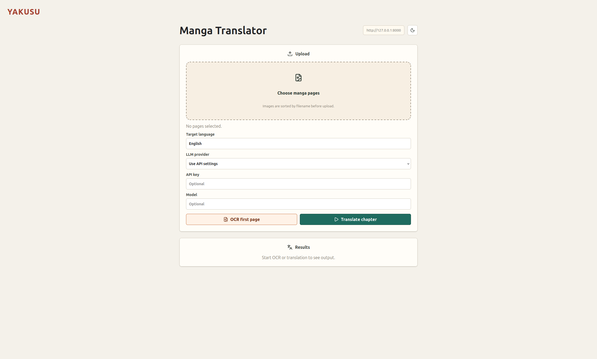
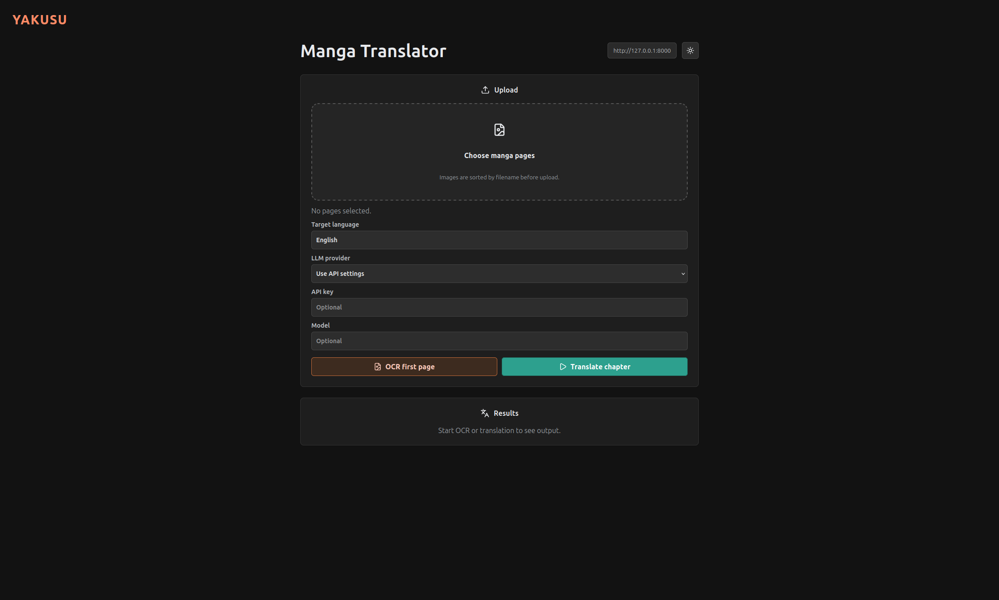
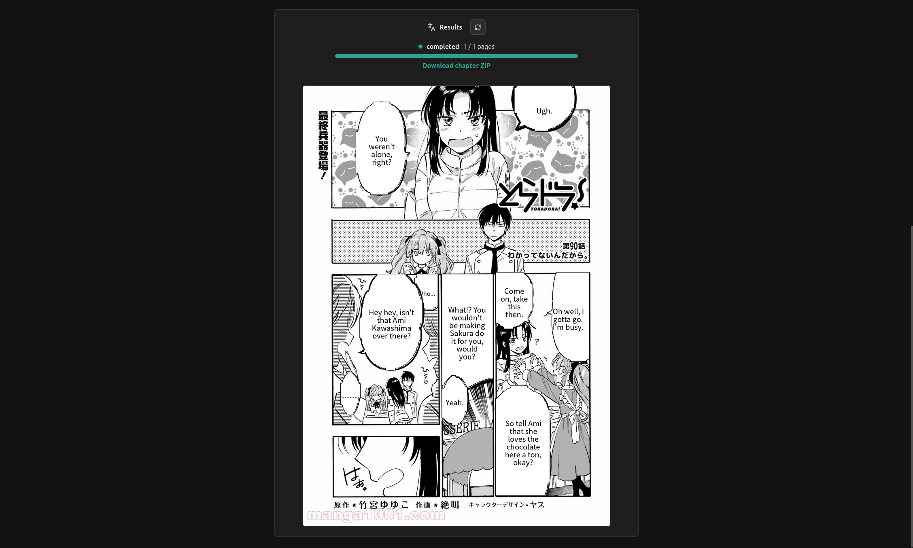

# Yakusu

Monorepo for Yakusu.

## Screenshots

### Light Mode


### Dark Mode


### Results


## Local Setup

1. Copy environment files:

   ```bash
   cp services/api/.env.example services/api/.env
   cp apps/web/.env.example apps/web/.env
   ```

2. Install dependencies:

   ```bash
   npm run setup
   ```

3. If you are using local Ollama translation, start Ollama and make sure the model exists:

   ```bash
   ollama serve
   ollama pull gemma2:9b
   ```

4. Start the API:

   ```bash
   npm run dev:api
   ```

5. Start the web app in another terminal:

   ```bash
   npm run dev:web
   ```

The web app runs at `http://localhost:5173` unless Vite chooses another open port.
The local API runs at `http://127.0.0.1:8000`.

## Services

- `services/api`: FastAPI manga OCR and translation service deployed to Hugging Face Spaces.

## Apps

- `apps/web`: React + Vite frontend.
